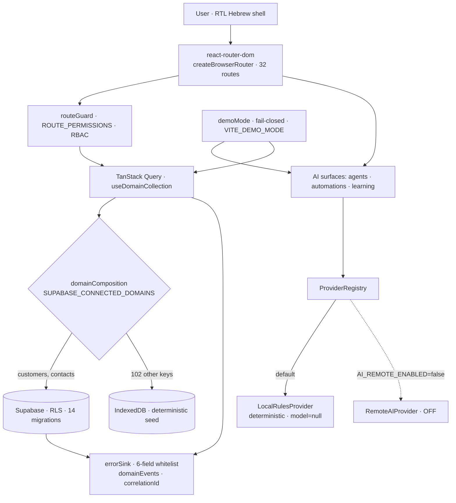

# TERAGON AI BUSINESS OS — Current System Map (S11.0)

**Audit type:** documentation-only. No code, flags, migrations, or data were changed.
**Date:** 2026-08-04 · **Branch:** `feature/teragon-full-system-audit`
**Source of truth:** running LOCAL build, `src/` code, route table, test suites, CI config.

---

## 0. One-paragraph truth

Teragon is a **React/Vite SPA** with a **Supabase** persistence seam. Exactly **two
domains — `customers` and `contacts` — are LIVE-VALIDATED against Supabase with
RLS** (`SUPABASE_CONNECTED_DOMAINS = ["customers","contacts"]`). Every other domain
(102 more collection keys) runs **LOCAL, fail-closed, from a deterministic IndexedDB
seed**. All AI surfaces run through a **deterministic `LocalRulesProvider`** that, by
its own contract, *"NEVER pretends to be an LLM"* (`provider="local-rules"`,
`model=null`); the remote model path exists but is **OFF by flag**
(`AI_REMOTE_ENABLED=false`). This is an academic final project with **synthetic data
only** — the map below is honest about what is real, what is demo, and what is static.

---

## 1. Routes & Navigation inventory

32 canonical routes (`src/app/routes.ts`) — 31 in-nav + 1 hidden detail route.
RBAC capability from `src/authorization/routeGuard.ts` (`null` = open, no gate).

**Status legend:** `LIVE_VALIDATED` (Supabase + RLS + acceptance) · `LOCAL_DEMO`
(IndexedDB seed, real CRUD, deterministic) · `DETERMINISTIC_DEMO` (local-rules AI, no
model spend) · `STATIC_CONTENT` (curated Hebrew content / evidence, no data layer).

| # | URL | Hebrew label | Wave | Capability | Data source | Status |
|--:|-----|--------------|:----:|-----------|-------------|--------|
| 1 | `/` | מרכז הפיקוד | 3 | `null` | aggregates local collections | LOCAL_DEMO |
| 2 | `/crm` | ניהול לקוחות ולידים (CRM) | 3 | `customer.read` | leads/opportunities (IDB) | LOCAL_DEMO |
| 3 | `/customers` | לקוחות | 3 | `customer.read` | **Supabase** | **LIVE_VALIDATED** |
| 4 | `/contacts` | אנשי קשר | 3 | `customer.read` | **Supabase** | **LIVE_VALIDATED** |
| 5 | `/customers/:id` | כרטיס לקוח (hidden) | 3 | `customer.read` | **Supabase** | **LIVE_VALIDATED** |
| 6 | `/sales` | מכירות והצעות מחיר | 3 | `sales.read` | quotations (IDB) | LOCAL_DEMO |
| 7 | `/courses` | קורסים ולמידה | 4 | `null` | courses (IDB) | LOCAL_DEMO |
| 8 | `/service` | שירות ותיקונים | 4 | `service.read` | serviceTickets (IDB) | LOCAL_DEMO |
| 9 | `/printers` | מדפסות ודגמים | 4 | `service.read` | printerModels (IDB) | LOCAL_DEMO |
| 10 | `/organizations` | ארגונים | 4 | `customer.read` | organizations (IDB) | LOCAL_DEMO |
| 11 | `/tasks` | משימות ופגישות | 4 | `null` | tasks/meetings (IDB) | LOCAL_DEMO |
| 12 | `/documents` | מסמכים והצעות מחיר | 3 | `sales.read` | documents (IDB) | LOCAL_DEMO |
| 13 | `/automations` | אוטומציות | 5 | `null` | rules engine (local) | DETERMINISTIC_DEMO |
| 14 | `/agents` | סוכני AI | 5 | `null` | 7 agents · local-rules | DETERMINISTIC_DEMO |
| 15 | `/agents/collaboration` | חדר התיאום של הסוכנים | 5 | `null` | orchestrator (local) | DETERMINISTIC_DEMO |
| 16 | `/memory` | זיכרון ארגוני · Obsidian | 6 | `null` | memoryRecords (IDB) | LOCAL_DEMO |
| 17 | `/knowledge` | מאגר ידע | 6 | `null` | knowledgeNotes (IDB) | LOCAL_DEMO |
| 18 | `/learning` | מרכז למידה ושיפור | 6 | `null` | local-rules signals | DETERMINISTIC_DEMO |
| 19 | `/analytics` | דוחות וניתוחים | 4 | `null` | computed from seed | LOCAL_DEMO |
| 20 | `/governance` | ממשל ובקרת AI | 4 | `governance.review` | governance records (IDB) | LOCAL_DEMO |
| 21 | `/implementation` | תכנית ההטמעה | 7 | `null` | curated content | STATIC_CONTENT |
| 22 | `/personas` | פרסונות ומסלולי הדרכה | 7 | `null` | curated content | STATIC_CONTENT |
| 23 | `/stage-gates` | Stage Gates · שערי מעבר וראיות | 7 | `null` | evidence index | STATIC_CONTENT |
| 24 | `/training-materials` | מרכז חומרי ההדרכה | 7 | `null` | curated content | STATIC_CONTENT |
| 25 | `/quick-start` | התחלה מהירה ושימוש נכון | 7 | `null` | curated content | STATIC_CONTENT |
| 26 | `/faq` | FAQ והתנגדויות | 7 | `null` | curated content | STATIC_CONTENT |
| 27 | `/support` | תמיכה לאחר ההשקה | 7 | `null` | curated content | STATIC_CONTENT |
| 28 | `/administration` | ניהול המערכת | 4 | `user.manage` | users/roles (IDB) | LOCAL_DEMO |
| 29 | `/system-health` | בריאות המערכת | 9 | `health.diagnostics` | local diagnostics | LOCAL_DEMO |
| 30 | `/settings` | הגדרות | 9 | `settings.update` | settings (IDB) | LOCAL_DEMO |
| 31 | `/submission` | מרכז ההגשה והראיות | 7 | `null` | evidence index | STATIC_CONTENT |
| 32 | `/submission/presentation` | מצגת ההגשה | 7 | `null` | curated content | STATIC_CONTENT |

**Totals:** 32 routes · **3 LIVE_VALIDATED** · 12 LOCAL_DEMO · 5 DETERMINISTIC_DEMO ·
12 STATIC_CONTENT. **Domains/modules:** ~14 business modules over **104 collection
keys**; **2** are Supabase-connected.

**Loading / empty / error:** every domain route uses the shared TanStack Query seam
(`useDomainCollection`) → deterministic loading state, honest empty states, and a
fail-closed typed error (no silent IndexedDB fallback in Supabase mode — ADR 0002).
`RootErrorBoundary` wraps the shell. Responsive/a11y/test coverage: §5–§6.

---

## 2. Technical architecture

**Boundaries:** composition (`loadSupabaseDomainRepository`) fails closed; observability
sanitizes to 6 whitelisted fields (`kind/code/domain/route/correlationId/timestamp`);
demo mode gates every external side-effect.

---

## 3. Functional Action audit (representative surfaces)

| Action | Location | Verdict |
|--------|----------|---------|
| Create/edit customer, contact | `/customers`, `/contacts` | **WORKING** (Supabase, RLS, 12/12 acceptance each) |
| Quick-add dialog + validation | shell header | **WORKING** (Hebrew validation, focus-safe) |
| CRUD on leads/tasks/tickets/etc. | 12 LOCAL_DEMO routes | **WORKING_DEMO_ONLY** (IndexedDB seed, resets per build) |
| Run agent / automation | `/agents`, `/automations` | **WORKING_DEMO_ONLY** (deterministic local-rules output) |
| Remote-model AI call | provider registry | **DISABLED_HONESTLY** (`AI_REMOTE_ENABLED=false`) |
| Backup / restore real data | ops | **NOT AVAILABLE** (staging free plan, no PITR — synthetic-only, §gap B1) |
| Static content pages | 12 STATIC_CONTENT routes | **WORKING** (render curated Hebrew content) |

**No NO_OP / BROKEN / MISLEADING actions found** in the audited surfaces. Demo-only
actions are labelled by the persistent Demo-Mode banner (not disguised as production).

---

## 4. Quality coverage — CI-equivalent local run (2026-08-04)

Ran the **static gate battery** (the CI `static-gate` + `accessibility-gate` +
`network-resilience-gate` equivalents). Excluded by instruction: live acceptance,
staging, restore, deploy.

| Check | Command | Result |
|-------|---------|--------|
| Build | `npm run build` | ✅ built in ~0.4s |
| Typecheck (app) | `npm run typecheck` | ✅ 0 errors |
| Typecheck (tests) | `npm run typecheck:tests` | ✅ 0 errors |
| Unit / integration | `npx vitest run` | ✅ **2551/2551 tests pass** (278 files) |
| — known local-only | `tests/platform/*` (12 files) | ⚠️ RolldownError parse on this machine only — **green in CI** (documented pre-existing local env issue, not a regression) |
| Accessibility gate | `e2e/a11y.config.ts` | ✅ **18/18** |
| Network-resilience gate | `e2e/network.config.ts` | ✅ **6/6** |
| Cross-browser matrix | `e2e/cross-browser.config.ts` | ✅ **9/9 cells** (chromium/firefox/webkit × 1440/768/390) — existing S10.3-C2 evidence after B4 fix |

**Gates: PASS.** Migrations remain **14** (no migration 015). `AI_REMOTE_ENABLED`
unchanged (`false`).
