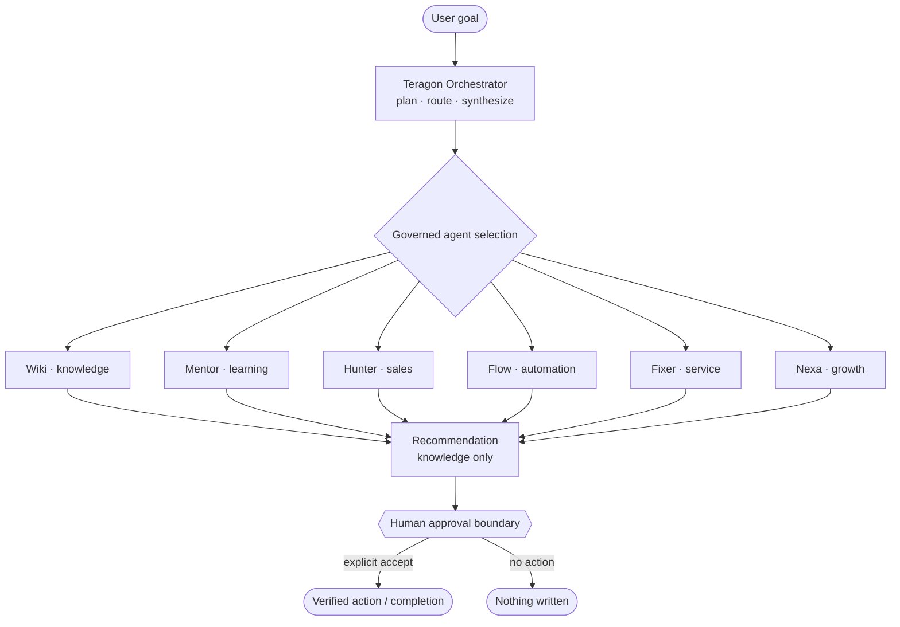
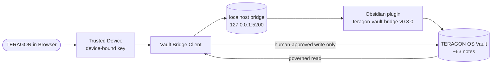
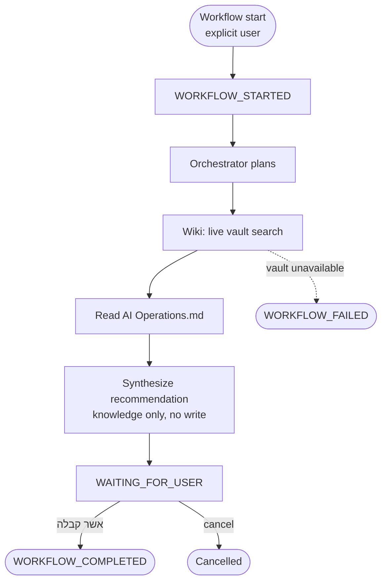
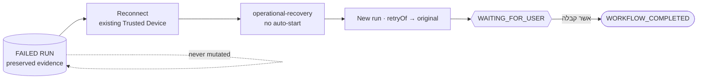

# TERAGON — Architecture

TERAGON is a **React 19 + TypeScript single-page application** (Vite) with a **local-first** data layer, a **centralized authorization** core, a **deterministic AI-agent** layer, and a **Trusted-Device Obsidian** integration. This document describes the actual architecture at SHA `4a6aed7`.

## Layers

- **Presentation** — `src/app` (shell, router, command palette), `src/modules/*` (portals, CRM, AI workspace, memory, analytics…), `src/design-system`.
- **Authorization** — `src/authorization` (roles, capabilities, portals, route scope, record scope, React guards).
- **Domain / data** — `src/domain/*` (types, agents, stage-gates, administration), `src/persistence` (provider abstraction), `src/app/data` (repositories/hooks). Local-first via IndexedDB (`idb`); Supabase RLS for org-scoped customer surfaces.
- **AI** — `src/agents` (7 agents, orchestrator, approval engine, governed workflows), `src/ai` (deterministic local rules provider; remote disabled).
- **Integration** — `src/integration/obsidian` (Trusted-Device auth, credential store, vault bridge client), `src/agents/obsidian` (deny-by-default agent vault access).

## 1. System architecture

```mermaid
flowchart TD
  User([User]) --> Portal[Role Portal<br/>Manager / Student / Technician]
  Portal --> RBAC[RBAC + Capabilities<br/>can(role, permission)]
  RBAC --> RouteGuard[RouteAccessGuard<br/>route scope]
  RouteGuard --> RecScope[Record Scope<br/>scopeRecords]
  RecScope --> Repos[(Repositories<br/>IndexedDB / Supabase RLS)]
  Portal --> AIW[AI Workspace]
  AIW --> Agents[7 Deterministic Agents<br/>+ Orchestrator]
  Agents --> Approval[Governed Approval Engine<br/>human gate]
  Agents --> Obsidian[Obsidian Integration]
  Repos --> UI[Role-composed UI]
  Obsidian --> Bridge[(Trusted-Device Bridge<br/>127.0.0.1:5200)]
```

## 2. Role security flow

Every request flows through the full chain — capability, then module (route) scope, then row (record) scope.

```mermaid
flowchart LR
  ID([Authenticated Identity]) --> Role[Canonical Role<br/>9 RBAC roles]
  Role --> Cap[Capability<br/>can(role, permission)]
  Cap --> PortalScope[Portal / Route Scope<br/>canAccessRoute]
  PortalScope --> RecordScope[Record Scope<br/>own rows only]
  RecordScope --> Result([Authorized Result])
  Cap -. deny .-> Denied([AccessDenied])
  PortalScope -. deny .-> Denied
  RecordScope -. fail-closed .-> Empty([Empty / no leak])
```

## 3. Agent architecture



## 4. Obsidian flow



## 5. Governed workflow



### Operational recovery

A failed run is **preserved as immutable evidence**; recovery is an **explicit new run** linked by `retryOf`, gated by a human, never a silent rewrite.



## Notable design decisions

- **Portal over roles** — portals are *derived* from the 9 canonical roles and only *restrict*; the RBAC model is untouched (`portalForRole`).
- **Deny-by-default routing** — `RouteAccessGuard` wraps every page; unauthorized routes render `AccessDenied`.
- **Centralized record scope** — a single `scopeRecords` predicate, called by the homes and global search, so scope can't drift; fail-closed (missing identity → empty, never "all").
- **Governed, deterministic AI** — no remote model; every consequential action stops at a human gate; agent vault access is deny-by-default (`canAgentReadObsidian`).
- **Runtime-only workflow history** — the live event log is intentionally in-memory (cleared on reload), preserved across SPA navigation.
