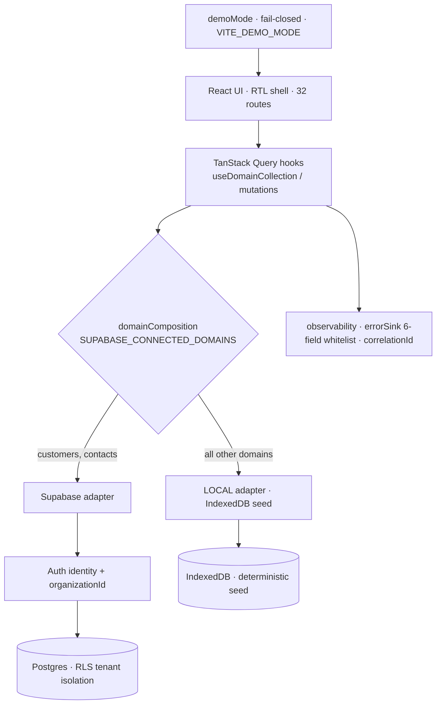
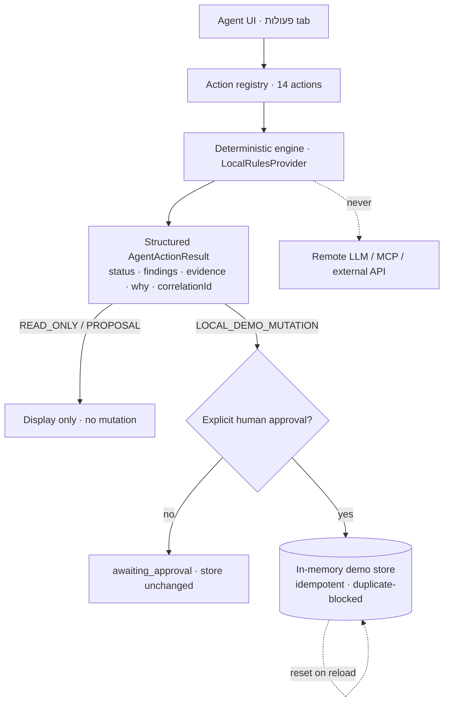
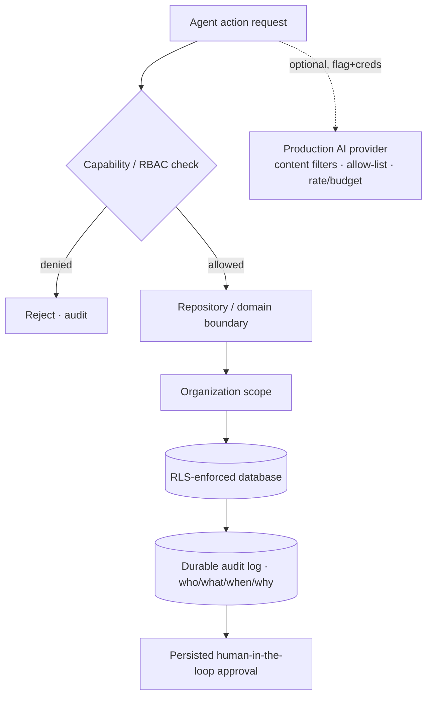

# Architecture Overview (S12.1)

Concise architecture for evaluators. Three diagrams: (A) the application today,
(B) the agent-action engine today, (C) the **future** production AI architecture — which
is **not** implemented and is shown only to contrast with the current demo.

## A. Application architecture (current)

React UI → hooks/domain composition → repositories → LOCAL or Supabase adapter →
Auth/org scope → RLS. The composition boundary is **fail-closed** (no silent IndexedDB
fallback in Supabase mode — ADR 0002).

## B. Agent-action architecture (current — Local Demo Action Engine)

Agent UI → action registry → deterministic engine → structured result (evidence, why) →
approval gate → **isolated synthetic in-memory store**. No remote model, no external
side effect. Local demo mutations reset on reload.

## C. Future production AI architecture (NOT implemented — target only)

A real production action layer must route every effect through the platform's real
seams. This is the **target**, explicitly out of scope for the academic submission.

## Current vs. future — the honest distinction

| Aspect | Current (this submission) | Future production (target) |
|--------|---------------------------|----------------------------|
| AI engine | Deterministic local rules | Optional real provider behind a flag |
| Agent mutations | Isolated in-memory demo store | Repositories + RLS + audit log |
| Persistence | Customers/Contacts live; rest demo | All domains durable |
| Approval | In-memory HITL gate | Persisted approvals + capability checks |
| Side effects | None (no email/webhook/MCP) | Allow-listed, audited, rate-limited |

The current implementation is a **demonstration of behaviour and safety posture**; it
does not claim the production seams above. See
[src/agents/actions/README.md](../../src/agents/actions/README.md) and ADRs 0001–0004.
